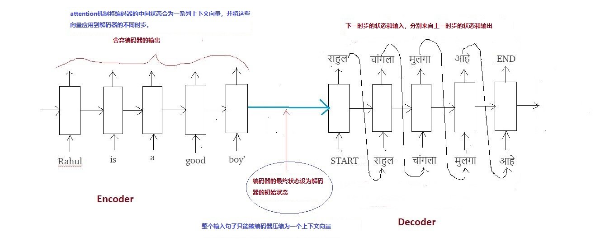
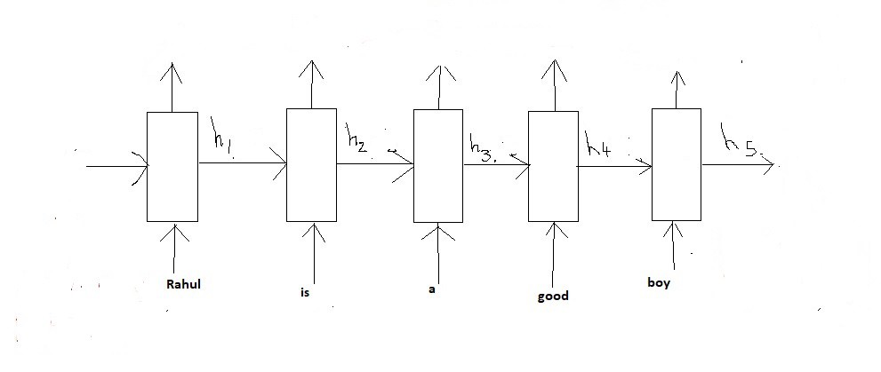
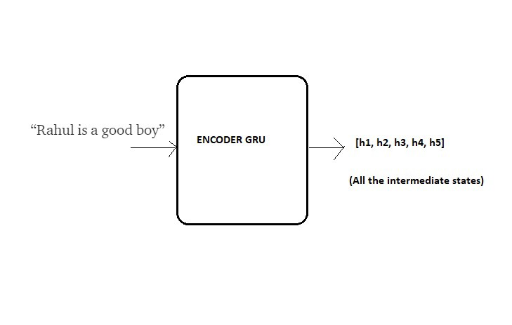
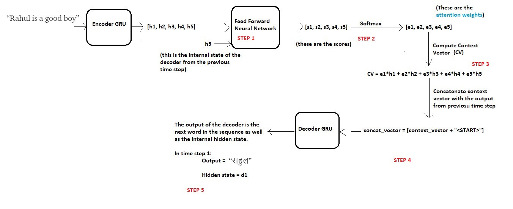
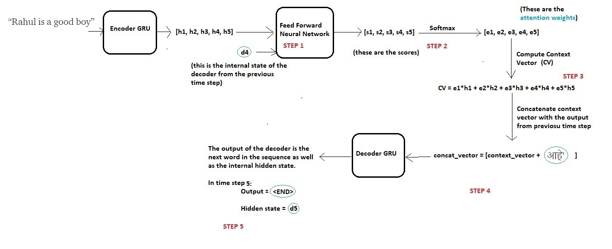

# 直观理解Attention机制

## 须知

这篇教程需要对sequence to sequence模型有基本的了解，可在[*博客文章*](https://towardsdatascience.com/word-level-english-to-marathi-neural-machine-translation-using-seq2seq-encoder-decoder-lstm-model-1a913f2dc4a7)了解Seq2Seq的细节。

## 目录

1. 引言
2. Attention核心思想
3. 为什么叫Attention？
4. Attention工作机制
5. 代码理解
6. 结果可视化
7. 参考文献

## 引言

Attention是深度学习社区最有影响里的模型之一。该机制被广泛应用在图像字幕等方面，但其最初是在Seq2Seq模型的神经网络机器翻译的背景下设计的。在这篇博客内，我会通过例子的方式描述这个概念。我们将会用attention设计一个将英文翻译为马拉语的翻译系统。

我们需要了解，Seq2Seq模型的问题出现在哪里？

Seq2Seq模型通常由一个编码器-解码器结构组成，编码器处理输入序列，并将信息经过编码/压缩/概括到一个固定长度的上下文向量中（thought vector），这个向量理论上是对整个输入序列的概括。解码器由上下文向量初始化，并生成转换后的输出。

**这种固定长度的上下文向量的设计有一个很明显的缺陷：无法处理更长的输入序列。一旦其处理了整个序列，很容易忘记序列的前半部分。attention机制就是为了解决这个问题而生的。**

让我们将其拆分了解细节。因为我已经在上一个[*博客*](https://towardsdatascience.com/word-level-english-to-marathi-neural-machine-translation-using-seq2seq-encoder-decoder-lstm-model-1a913f2dc4a7)解释了很多基本概念，本文将直接讨论核心部分。

## Attention核心思想

输入句子（英语）：“Rahul is a good boy”

目标句子（马拉语）：“राहुल चांगला मुलगा आहे”

为了便于解释，网络结构会选择GRU结构而不是LSTM结构，因为LSTM有两个内部状态（隐状态和单元状态），而GRU只有一个内部状态（隐状态）。以此简化概念的描述。

先回顾一下Seq2Seq的整个过程：

在传统的Seq2Seq模型中，我们舍弃了编码器所有的中间状态，只用最终状态来初始化解码器。这种模式适合较小的序列，但当序列内容变多时，一个状态向量无法概括整个序列的内容。基于经验观察，序列的内容变多，模型的效果会急剧下降。

而attention的核心思想是不舍弃编码器的中间状态，将所有中间状态合为一系列上下文向量（context vectors），然后初始化解码器。

## 为什么叫Attention？

让我们先明确编码器的每个内部状态：

编码器GRU

需要注意的是，我们用GRU代替了LSTM，每个步骤都只有一个内部状态。h1-h5的都是固定长度的向量，在这里我们假设这些向量代表的状态存储的是序列的本地信息。

h1保存序列头部信息（单词 “Rahul” 和 “is” ），h5保存序列尾部信息（单词 “good” 和 “boy” ）

简化后的编码器：

编码器GRU的简化表达

现在我们需要用这些当前信息来生成编码器的目标序列。如果你要将 “Rahul is a good boy” 翻译为 “हुल चांगला मुलगा आहे” ，你会怎么做？

当我们预测名字 “राहुल” 时，很明显它对应的时当前英语句子中的 “Rahul” 而不是其他的单词。也就是当预测 “राहुल” 时，我们更多地关注（pay more attention）单词 “Rahul” ；类似地，当预测 “चांगला” 时，我们更多地关注单词 “good” ；预测 “मुलगा” 时，更多地关注的单词 “boy” ；以此类推。

因此命名为 **“ATTENTION”（注意力）**

对于输入序列和对应的输出序列，人们可以简单地一一对应。但是神经网络无法做到这点。Attention机制旨在通过梯度下降和反向传播 **“学习”** 这种映射。

## Attention工作机制

接下来了解Attention机制的细节

### 解码时步一（time step 1）

接着上面的例子，现在我们希望编码器能够预测目标序列的第一个词 “राहुल” 。

我们将时步一分为四个步骤：

解码时步一

在开始解码之前，需要将输入序列编码为内部状态的集合（本例中的h1，h2，h3，h4，h5）

理论上，输出序列的下一个单词需要参照解码器的当前状态（解码器是GRU）和编码器的隐藏状态。因此在每一个步骤中我们需要考虑这两个条件：

#### 步骤一—— 对编码器状态计分

预测第一个单词时，解码器没有任何内部状态，我们只能参考编码器的最后一个状态（h5）作为解码器的前一个状态。

现在用这两个条件（所有的编码器状态和当前解码器状态）训练一个简单的神经网络。

为什么要这样做？

因为我们目的是预测目标序列的第一个单词 “राहुल” ，在attention概念中，不需要使用编码器的所有状态来预测这个单词，而仅仅需要存储着与输入序列“Rahul”单词相关的编码器状态。

因为编码器的内部状态保存着输入序列的局部信息，所以单词 “Rahul” 的信息很有可能也被保存在这些状态中，也就是h1和h2。

因此，我们希望解码器能更多地关注状态h1和h2，较少地关注其他状态。

为了完成上面的目标，我们需要训练一个前向神经网络，用于**学习**如何识别相关的编码器状态，对于得分高的状态会得到更多attention，反之得分少的状态会被忽视。

设定s1，s2，s3，s4，s5是状态h1，h2，h3，h4，h5的得分。因为我们设定预测 “हुल” 时需要更多地关注h1和h2而忽视h3，h4，h5，所以我们期望神经网络能够让s1，s2分数较高且s3，s4，s5分数较低。

#### 步骤二——计算attention权重

将得到的分数应用到softmax层，获取attention权重e1，e2，e3，e4，e5。使用softmax层的优势如下：

a）所有的权重都在0和1之间，即0 ≤ e1, e2, e3, e4, e5 ≤ 1

b）所有的权重总和为1，即e1+e2+3+e4+e5 = 1

这在attention权重上给出了一个简明的概率解释。

在本例中，我们期望权重值应该类似（直觉上）：

e1 = 0.75, e2 = 0.2, e3 = 0.02, e4 = 0.02, e5 = 0.01

这意味着当预测单词"राहुल"时，解码器需要更多地关注状态h1和h2（因为e1和e2值较大），而忽略状态h3，h4，h5（因为e3，e4，e5值较小）

#### 步骤三——计算上下文向量

在得到attention权重后，需要计算上下文向量（thought vector），用于解码器预测下一个单词，计算方式如下：

context_vector = e1 * h1 + e2 * h2 + e3 * h3 + e4 * h4 + e5 * h5

e1、e2的值较大而e3、e4、e5的值较小，所以上下文向量会包含更多关于状态h1、h2的信息，和更少的其他状态信息。

#### 步骤四——上下文向量和前一个时步输出进行拼接

解码器利用两个输入向量来生成序列的下一个单词：

a）上下文向量

b）前一个时步的单词输出

将两个向量拼接并传入解码器。**需要注意的时，对于时步一，它没有前一个时步，我们使用\<START>标记这是第一个时步**。这个概念在之前的[*博客*](https://towardsdatascience.com/word-level-english-to-marathi-neural-machine-translation-using-seq2seq-encoder-decoder-lstm-model-1a913f2dc4a7)有详细介绍。

> *译者注：在第一个时步，START标记提示解码器开始生成下一个标记（实际是目标序列的第一个单词）；在生成最后一个单词后，我们让解码器学会预测END标记。作为推断过程的结束条件，表示句子翻译结束，推断循环也可以停止。*

#### 步骤五——编码器输出

编码器接下来生成序列的下一个单词（本例中也就是第一个单词 “राहुल” ），除了这个输出，编码器还好生成一个内部隐状态，我们称其为“d1”。

### 解码时步二

为了生成下一个单词 “चांगला” ，编码器会重复同样的过程：

### 解码时步三

### 解码时步四

### 解码时步五

一旦解码器输出\<END>标识，就停止生成过程。

在传统Seq2Seq模型中定长上下文向量用于解码器的所有时步，但在Attention中上下文向量由attention权重计算得到，所以每一个时步都有不同的上下文向量。

这个机制会在输入序列和对应的输出序列产生不同的映射。

在网络训练期间使用teacher forcing机制。该概念在上一篇[*博客*](https://towardsdatascience.com/word-level-english-to-marathi-neural-machine-translation-using-seq2seq-encoder-decoder-lstm-model-1a913f2dc4a7)进行了解释。

> *译者注：“Teacher Forcing”机制，使用前一个时步的实际输出（而不是预测的输出）即目标输出，作为下一个时步的输入，这有利于网络的高效训练。*

## 代码理解

## 结果可视化

> *译者注：原博中这两部分主要以代码和图片为主，有兴趣者可在本文底部链接查看*

## 结论

使用Attention机制的翻译结果要远远好于Seq2Seq模型的结果；该机制可以找到输入和输出正确的局部映射。

如果有更多的数据和更多的超参，实验结果和映射会有更好的效果。

如果使用LSTM层和而不是GRU，并且在编码器添加bidirectional封装器，也会提升实验结果。

深度学习模型通常被认为是黑盒模型，因为人们无法解释它的输出。然而Attention机制使模型变得可解释，是什么和为什么。

Attention机制的唯一一个缺点是非常耗时且很难做到并行运行。为了解决这个问题，Google Brain提出“Transformer Model”，只使用Attention同时去掉卷积层和循环层，使得Attention机制具有高并发性和高效性。

## 参考文献

- <https://arxiv.org/abs/1409.0473> (Original Paper)
- <https://github.com/tensorflow/tensorflow/blob/master/tensorflow/contrib/eager/python/examples/nmt_with_attention/nmt_with_attention.ipynb> (TensorFlow Implementation available on their official website as a tutorial)
- <https://www.coursera.org/lecture/nlp-sequence-models/attention-model-lSwVa> (Andrew Ng’s Explanation on Attention)
- <https://jalammar.github.io/visualizing-neural-machine-translation-mechanics-of-seq2seq-models-with-attention/>
- <https://www.tensorflow.org/xla/broadcasting> (Broadcasting in TensorFlow)
- Dataset: <http://www.manythings.org/anki/> (mar-eng.zip)

原文：[Intuitive Understanding of Attention Mechanism in Deep Learning](<https://towardsdatascience.com/intuitive-understanding-of-attention-mechanism-in-deep-learning-6c9482aecf4f>)