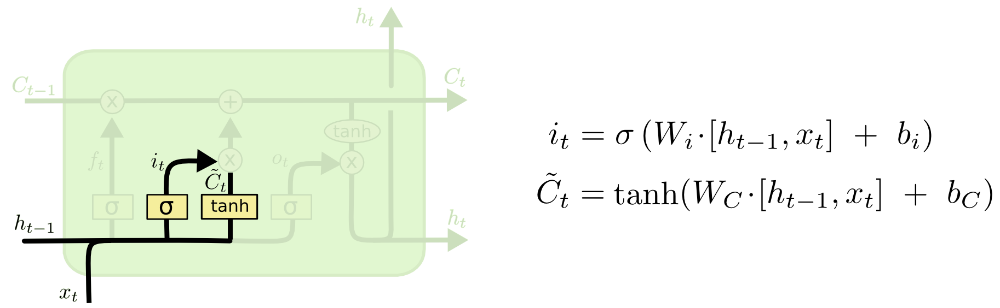

# 理解LSTM网络

### 递归神经网络（RNN)

每次的思考都不是从头开始的。就像你在阅读的本篇文章，基于之前的积累，你能够理解当前的内容。你不会把经验全部抛弃然后从头开始思考。思维是延续的。

但对于传统神经网络来说这个规则是行不通的，这是传统神经网络最大的缺点。如果你想对电影中的每一个场景进行分类，传统神经网络很难做到根据前一个前景来推断下一个场景。RNN解决了这一问题，其内部的环形回路保证信息的延续。

<strong>RNN内部的循环</strong>

在上图中，神经网络A，输入xt和输出ht，其中的环可以让信息不断的传递。

这些环让RNN变得有些神秘。但是认真思考一下，其实它和普通神经网络只有一点差别。RNN可以被看作是多个相同网络，且每个神经网络都会给下一个传递信息。打开环就会变成这样：

<strong>展开的RNN</strong>

这种类似链式结构表示RNN本质上和序列及列表密切相关，对于这类数据RNN链式结构网络是比较自然的处理方式。

在过去几年，RNN的研究解决了许多问题：语音识别、语言建模、翻译、图像字幕...RNN的应用介绍可参考[The Unreasonable Effectiveness of Recurrent Neural Networks](http://karpathy.github.io/2015/05/21/rnn-effectiveness/)其中LSTM的表现最为突出——针对多任务的RNN模型。

### RNN面临的问题

RNN最主要的优势在于它或许能够将过去的信息连接到当前任务中，就像用视频的前一帧推断出下一帧的内容。但是RNN能否做到这一点是需要看实际情况的。

在一些情况下，我们只需要过去的一小段信息来完成当前任务。比如，一个语言模型需要基于过去的一些词来推断下一个词，推断“云朵飘在**天空**”的最后一个词，我们并不需要更多的内容，因为很明显云朵就会飘在天空。也就是说，当相关信息和所需信息之间的距离很小时，RNN可以学习并使用过去的信息。

但是在另一些情况下，我们需要更多的信息。比如，推断”我在法国长大...我能说流利的**法语**“的最后一个词，中间省略的信息或许能暗示最后一个词是某语言的名称，但是要确定具体的名称我们则需要上文中的”法国“。在现实生活中，存在很多相关信息和所需信息的距离很大的例子。

然而随着距离的增大，RNN会更难学到相关信息。

理论上，RNN可以处理这种"long-term dependencies"，我们可以通过仔细调参来解决类似问题。但实际上，RNN很难学到有用的信息，具体原因详见[Hochreiter (1991) [German\]](http://people.idsia.ch/~juergen/SeppHochreiter1991ThesisAdvisorSchmidhuber.pdf) and [Bengio, et al. (1994)](http://www-dsi.ing.unifi.it/~paolo/ps/tnn-94-gradient.pdf)。

值得庆幸的是，LSTM可以解决上述问题！

### LSTM网络

LSTM（Long Short-Term Memory）是一种特殊的递归神经网络(RNN，适合处理“长long-term dependencies”问题（时间序列中间隔和延迟非常长的重要事件），该结构由[Hochreiter & Schmidhuber (1997)](http://www.bioinf.jku.at/publications/older/2604.pdf)提出，在之后的研究中得到了广泛的应用。1

RNN都具有多个重复的NN组成的链式结构，在标准的RNN网络中，这些重复结构非常简单，如单个tanh层：

    

<strong>标准RNN内部 重复模型包含单个层</strong>

LSTM也有类似的链式结构，不同的是，LSTM中的重复网络是由四层相连接的网络组成：

    

<strong>LSTM内部 重复模型包含四个层</strong>

内部网络细节将在后面讨论，各个图标的含义入如下：

上图中的每条线表示一个向量，该向量从一个节点输出传入下一个节点。粉色的圆圈代表点乘操作，如向量加法；黄色方块代表NN层；线的聚合表示向量拼接；线的复制表示内容复制，且副本会被传到其他位置。

### LSTM核心思想

LSTM的关键是单元状态（cell state），也就是贯穿图表上方的一条水平线。

单元状态类似传送带，它直接穿过整个链式结构，仅包含次要的线性操作。因此，信息在单元状态的传输可以保持不变。

LSTM通过门（gates）来控制传入单元状态信息的增加和删除。门由一个sigmoid层和点乘操作组成，有选择地让信息通过。sigmoid层的输出在0到1之间，其值表示通过的信息比例。输出值是0，表示所有信息都不可通过，输出值是1则表示所有信息都可以通过。

每个LSTM有三个门，用于保护和控制单元状态。

### LSTM阶段分析

第一阶段，LSTM需要决定哪些信息应该抛弃。这一步由sigmoid层完成，称作“遗忘门“层。首先”遗忘门“层会接收单元状态Ct-1>传入的ht-1和xt，得到一个(0, 1)之间的数值。

以语言模型为例，当前状态可能包括了当前目标的”性别“一词，但如果模型发现了一个新的对象，就需要忘记旧目标的性别（因为新对象有新性别）。

第二阶段，LSTM需要决定哪些信息应该保存。这个阶段由两部分完成：sigmoid层，称作”输入门“层，判断待更新的值；tanh层，创建一个向量$\widetilde{C}$t,。这两个值在下一阶段用来更新单元状态。

对于语言模型，我们需要用新目标的性别来替换已经被抛弃的旧目标的性别。

第三阶段，将旧单元状态Ct-1更新并传入新单元状态Ct。将第一阶段筛选出的信息ft乘以旧单元状态Ct，再加上it * $\widetilde{C}$t。等式第二项表示$\widetilde{C}$t由it来控制大小。

对于语言模型，这表示我们剔除旧目标的性别，并添加新信息。

最后，需要将单元状态进行筛选并输出。筛选过程如下：首先，sigmoid层确定状态的部分内容进行输出；然后，将第三个阶段得到的状态C<subt传入tanh层（保证值在-1到1之间），并乘上sigmoid输出。这样可保证网络的输出是我们所期望的。

对于语言模型，如果看到一个目标，它接下来会输出一个相关的动词，而这个目标的单数或复数决定了动词的形式。

### LSTM的变体

到目前为止介绍的都是常见的LSTM结构，但是随着研究的发展，每篇涉及到LSTM的论文都会有不同的版本。虽然改变并不大，但非常值得讨论。

一个比较流行的LSTM变体是由[Gers & Schmidhuber (2000)](ftp://ftp.idsia.ch/pub/juergen/TimeCount-IJCNN2000.pdf)提出，他们在LSTM中加入了”窥视孔连接“（peephole connections），这意味着门可以”看到“单元状态。

上图显示的网络结构，所有的门都增加了窥视孔，具体情况还要看不同论文的设计。

另一个LSTM的变体是将”遗忘门“和”输入门“的两个sigmoid层合为一个，输入的信息刚好填补被遗忘的信息。

还有一个比较夸张的变体叫做Gated Recurrent Unit，简称GRU，由[Cho, et al. (2014)](http://arxiv.org/pdf/1406.1078v3.pdf)提出。GRU不仅将”遗忘门“和”输入门“合为一个“更新门”，而且将单元状态和隐状态合并，还有些其他的改变。这让LSTM结构更加简单，被越来越多的研究者应用。

除了上面三个LSTM的变体外，还有Depth Gated RNNs [[Yao, et al. (2015)](http://arxiv.org/pdf/1508.03790v2.pdf)]、Clockwork RNNs [[Koutnik, et al. (2014)](http://arxiv.org/pdf/1402.3511v1.pdf)]。而[Greff, et al. (2015)](http://arxiv.org/pdf/1503.04069.pdf)比较了目前较为流行的几个LSTM变体，发现他们的效果差别不大；[Jozefowicz, et al. (2015)](http://jmlr.org/proceedings/papers/v37/jozefowicz15.pdf)比较了超过一万个RNN结构，发现一些网络结构在特定的任务上效果好于LSTM。

### 结论

其实许多在RNN上效果好的结果本质上都是用LSTM实现的。

LSTM是RNN的一大改变，而attention则是另一个改变。attention的思想是RNN的每一步都会参考更多过去的信息[Xu, *et al.* (2015)](http://arxiv.org/pdf/1502.03044v2.pdf)。

除了attention之外，Grid LSTM [[Kalchbrenner, *et al.* (2015)](http://arxiv.org/pdf/1507.01526v1.pdf)]也非常有意义，[Gregor, *et al.* (2015)](http://arxiv.org/pdf/1502.04623.pdf), [Chung, *et al.* (2015)](http://arxiv.org/pdf/1506.02216v3.pdf)和 [Bayer & Osendorfer (2015)](http://arxiv.org/pdf/1411.7610v3.pdf)则将RNN应用在了生成模型上。

		1.  除了最初的提出者，很多人也对LSTM模型也有贡献，包括：Felix Gers, Fred 		Cummins, Santiago Fernandez, Justin Bayer, Daan Wierstra, Julian Togelius, Faustino Gomez, Matteo Gagliolo, and [Alex Graves](https://scholar.google.com/citations?user=DaFHynwAAAAJ&hl=en)

原文：[Understanding LSTM Networks](<https://colah.github.io/posts/2015-08-Understanding-LSTMs/>)

